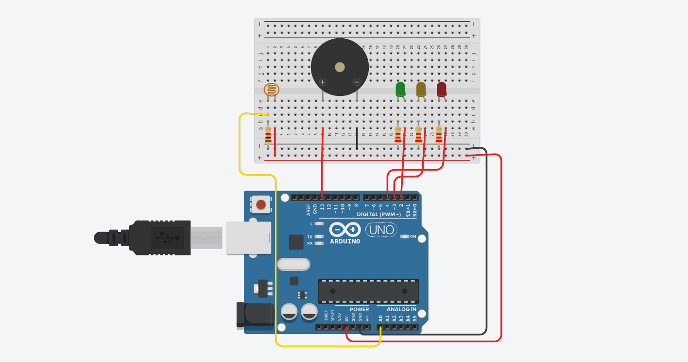

# Meu Projeto

Este é um projeto que controla um semáforo baseado em um sensor de luz.

## Instalação

1. Clone o repositório para o seu computador.
2. Faça o upload do código para o Arduino.
3. Conecte o sensor de luz e os LEDs conforme o esquema de ligação fornecido.
4. Ligue o Arduíno e teste o funcionamento do semáforo.

## Uso

Você pode usar este projeto como base para aprender sobre programação Arduino e controle de dispositivos eletrônicos.

## Contribuição

Contribuições são bem-vindas! Se você encontrar algum problema ou tiver alguma sugestão de melhoria, sinta-se à vontade para abrir uma issue ou enviar um pull request.

## Licença

Este projeto está licenciado sob a MIT License - consulte o arquivo LICENSE para obter mais detalhes.

# My Project

This is a project that controls a traffic light based on a light sensor.

## Installation

1. Clone the repository to your computer.
2. Upload the code to the Arduino.
3. Connect the light sensor and LEDs according to the provided wiring diagram.
4. Power on the Arduino and test the traffic light's functionality.

## Usage

You can use this project as a basis for learning about Arduino programming and controlling electronic devices.

## Contribution

Contributions are welcome! If you encounter any issues or have any suggestions for improvement, feel free to open an issue or submit a pull request.

## License

This project is licensed under the MIT License - see the LICENSE file for more details.